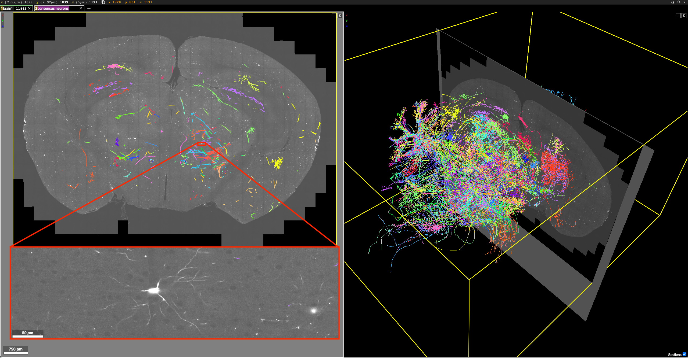
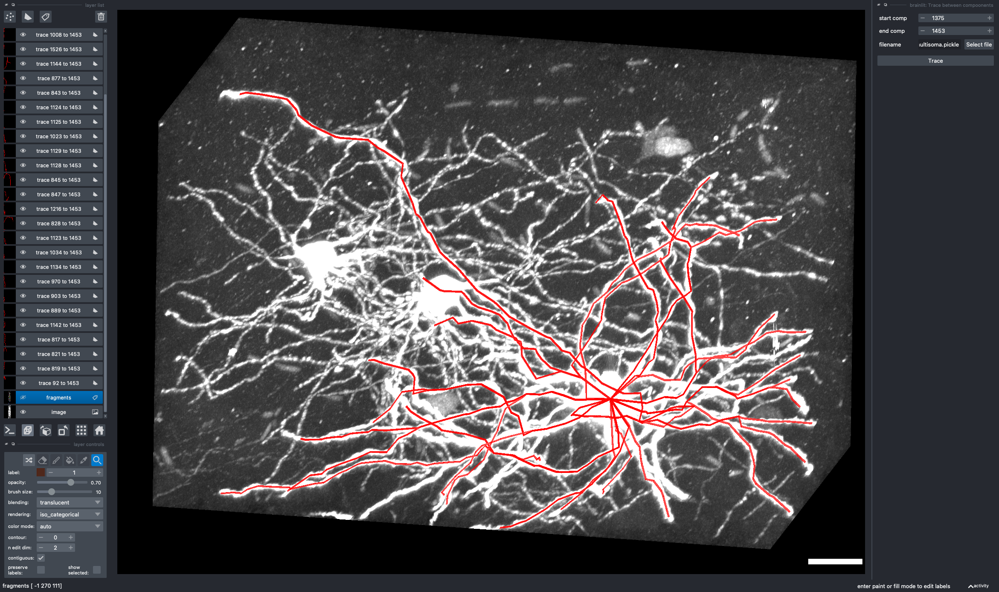

<!-- 
 -->

# Graphical User Interface for Semi-Automated Tracing of Neuronal Processes

## Thomas L. Athey1*, Michael I. Miller1

##### 1 - Department of Biomedical Engineering, Johns Hopkins University   $\ast$ - correspondence:  [_tathey1@jhu.edu_](mailto:tathey1@jhu.edu)  [_@tathey1 (Github)_](https://github.com/tathey1)  [_@Thomas_L_Athey (Twitter)_](https://twitter.com/Thomas_L_Athey)

 Summary 

- We aimed to build a tool for faster neuron tracing in neuromorphological research.

- Our hidden Markov modeling based approach incorporates a geometric prior and the image appearance likelihood.

- The globally optimal sequence of neuron fragments is computed efficiently with dynamic programming.

- *ViterBrain* outperforms state-of-the-art on a dataset of partial axons in a MouseLight brain image.

- Our algorithm is available as a napari plugin in our open-source Python package, brainlit.

### Motivation

- A neuron's morphology determines how it integrates into brain circuits and contributes to overall brain function.
- Efforts to build brain-wide atlases of neuron morphology in the mouse rely on laborious manual tracing [1].
- Future work in human brains will exacerbate this bottleneck.

### Data

**Fig 1:** Sample from Janelia Mouselight project. Sparse labeling is achieved using a diluted AAV Syn-iCre and a Cre-dependent reporter. Images are acquired by serial two-photon tomography at $0.3 \times 0.3 \times 1.0 \mu m^3$  resolution.

### HMM Based Reconstruction

**Fig 2:** Overview of *ViterBrain* algorithm [2]. *ViterBrain* takes in an image and probability mask. The mask is processed into a set of fragments, whose endpoints and endpoint tangent vectors are estimated. Transition probabilities are computed according to image data and fragment geometry then the globally optimal fragment sequence is computed.

- Identify sequence of neuron fragments $\{ f_i \}_{i=1}^n$ that follows neuronal path.
- Hidden Markov model incorporates:

    1. **Observed variable**: Image data $I$
    2. **Hidden variable**: Neuron path $\{ f_i \}_{i=1}^n$

### Results and Conclusions

**Fig 3:** A neuron that was partially traced using the *ViterBrain* napari plugin. The plugin widget is on the right toolbar. The scale bar represents 20 microns.

- ViterBrain had a significantly higher success rate than state-of-the-art algorithms in a dataset of partial axons in a MouseLight brain sample [1].
- We built a plugin for napari, a popular multidimensional image viewer in Python, which can be used to accelerate neuron reconstruction workflows.

### Limitations and extensions
- More work is needed to extend the algorithm to densely tangled neurons, and to whole-brain volumes.

###

#### Code

brainlit.neurodata.io

#### Acknowledgements
<footer>
We thank the MouseLight team at HHMI Janelia for providing us with access to this data. Thanks to Benjamin Pedigo for the poster template.
</footer>

#### References

<footer>
[1] Winnubst J. et. al. Cell. 2019;179(1):268-281.
 
[2] 2.	Athey T. L. et al. arXiv. 2022;2106.02701.
</footer>

#### Funding

<footer>
This work is supported by the National Institutes of Health grant RF1MH121539. 
</footer>

